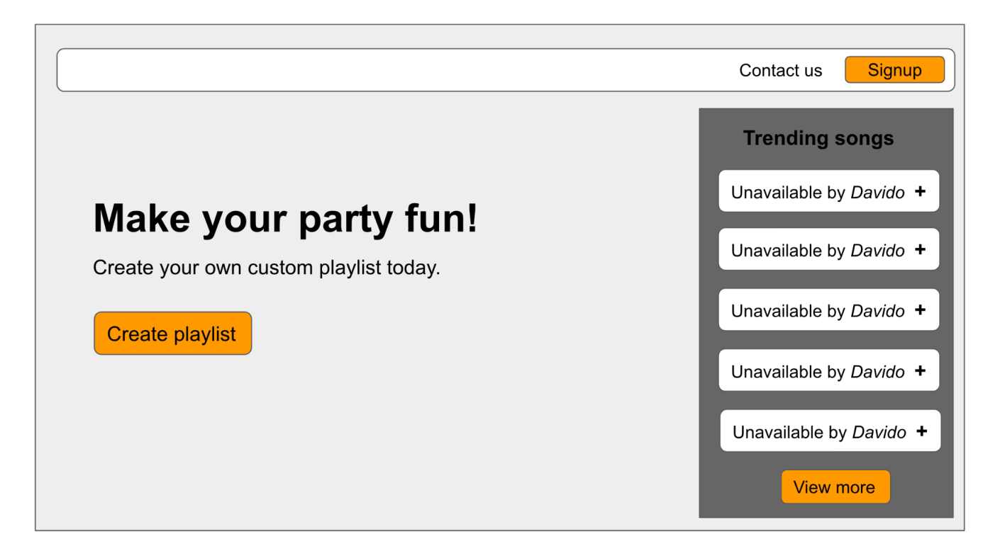

<a name="readme-top"></a>

<div align="center">
  
  <br/>
</div>


# 📗 Table of Contents

- [📖 About the Project](#about-project)
  - [Mockup](#mockup)
  - [🛠 Built With](#built-with)
    - [Tech Stack](#tech-stack)
    - [Key Features](#key-features)
  - [🚀 Live Demo](#live-demo)
  - [📷 Screenshot](#screenshot)
- [💻 Getting Started](#getting-started)
  - [Setup](#setup)
  - [Prerequisites](#prerequisites)
  - [Install](#install)
  - [Usage](#usage)
  - [Run tests](#run-tests)
  - [Deployment](#deployment)
- [👥 Authors](#authors)
- [🔭 Future Features](#future-features)
- [🤝 Contributing](#contributing)
- [⭐️ Show your support](#support)
- [🙏 Acknowledgements](#acknowledgements)
- [❓ FAQ (OPTIONAL)](#faq)
- [📝 License](#license)

# 📖 Edustipend Front-End Engineer Assessment <a name="about-project"></a>

This project is an assessment for the position of FFront-end Engineer (React) Volunteer at Edustipend. The purpose of this project is to test my skills and knowledge in ReactJS, HTML, CSS, and JavaScript.

The project is divided into two parts:

- Identification of core components
- Writing React code for two of the components

## Mockup <a name="mockup"></a>



Based on the given [mockup](#mockup), the following can be identified as the core components of the project:
- **Header component:** this component contains the contact us link, signup button component.
- **Hero component:** Here, we have a heading text, a subtext and a button component.
- **Aside card component:** Here, we have a heading text, a series if list item component showing trending songs and icon and "see more" button component.

<p align="right">(<a href="#readme-top">back to top</a>)</p>

## 🛠 Built With <a name="built-with"></a>

### Tech Stack <a name="tech-stack"></a>

- [React](https://reactjs.org/)
- [React Bootstrap](https://react-bootstrap.github.io/)
- [Bootstrap](https://getbootstrap.com/)
- [React Icons](https://react-icons.github.io/react-icons/)
- [PropTypes](https://www.npmjs.com/package/prop-types)
- [Sass](https://sass-lang.com/)

### Key Features <a name="key-features"></a>

- [x] The use of React Bootstrap to provide a responsive and customizable user interface.
- [x] The use of Bootstrap to provide a library of pre-styled components.
- [x] The use of React Icons to provide a library of React components for displaying icons.
- [x] The use of PropTypes to provide type safety for React components.
- [x] The use of Sass to provide a powerful CSS preprocessor.

<p align="right">(<a href="#readme-top">back to top</a>)</p>

## 🚀 Live Demo <a name="live-demo"></a>


- [Live Demo Link](https://fmanimashaun.github.io/edustipend-submit/)

## 📷 Screenshot <a name="screenshot"></a>


<p align="right">(<a href="#readme-top">back to top</a>)</p>

## 💻 Getting Started <a name="getting-started"></a>

### Prerequisites <a name="prerequisites"></a>

- [Optional] Install git bash to your machine to enable you to clone this repo.
- install Visual Studio to be able to host a local live version.
- Install a browser to view the local live version.

To get a local copy up and running follow these simple example steps.
### Setup <a name="setup"></a>

Clone this repository to your desired folder:

```sh
  cd your-desired-folder
  git clone https://github.com/fmanimashaun/edustipend-submit.git
  open the repo folder `edustipend-submit`
```

### Install <a name="install"></a>

Install this project dependencies with:

```sh
  npm install
```

### Usage <a name="usage"></a>

To run the project, execute the following command:

```sh
  npm run start
```

Runs the app in the development mode.\
Open [http://localhost:3000/edustipend-submit](http://localhost:3000/edustipend-submit) to view it in your browser.

The page will reload when you make changes.\
You may also see any lint errors in the console.

### Run tests <a name="run-tests"></a>

To run tests to check the lint errors, run the following command:

- To check for CSS lint errors, run the following command:

```sh
  npm run stylelint
```

- To check for JS lint errors, run the following command:

```sh
  npm run eslinter
```

Launches the test runner in the interactive watch mode.\
See the section about [running tests](https://facebook.github.io/create-react-app/docs/running-tests) for more information.

### Deployment <a name="deployment"></a>

You can deploy this project to github pages by running the following command:

```sh
  npm run deploy

```

Builds the app for production to the `build` folder.\
It correctly bundles React in production mode and optimizes the build for the best performance.

The build is minified and the filenames include the hashes.\
and it is automatically deployed to the github page.

See the section about [github page deployment](https://github.com/gitname/react-gh-pages) for more information.

<p align="right">(<a href="#readme-top">back to top</a>)</p>

## 👥 Authors <a name="authors"></a>

👤 **Engr. Animashaun Fisayo**

- [GitHub](https://github.com/fmanimashaun)
- [Twitter](https://twitter.com/fmanimashaun)
- [LinkedIn](https://www.linkedin.com/in/fmanimashaun/)
- [Website](https://fmanimashaun.com)

<p align="right">(<a href="#readme-top">back to top</a>)</p>

## 🔭 Future Features <a name="future-features"></a>

-[ ] Add api to fetch data for the aside card component.  

<p align="right">(<a href="#readme-top">back to top</a>)</p>

## 🤝 Contributing <a name="contributing"></a>

Contributions, issues, and feature requests are welcome!

Feel free to check the [issues page](../../issues/).

<p align="right">(<a href="#readme-top">back to top</a>)</p>

## ⭐️ Show your support <a name="support"></a>

If you like this project and want to support me, you can give a ⭐️ to this repo!

<p align="right">(<a href="#readme-top">back to top</a>)</p>


## 🙏 Acknowledgments <a name="acknowledgements"></a>


I would like to thank [Edustipend](https://www.edustipend.org/) for giving me this opportunity to take part in the pre-assessment test.

<p align="right">(<a href="#readme-top">back to top</a>)</p>


## ❓ FAQ (OPTIONAL) <a name="faq"></a>

> None for now

<p align="right">(<a href="#readme-top">back to top</a>)</p>

## 📝 License <a name="license"></a>

This project is [MIT](./LICENSE) licensed.

<p align="right">(<a href="#readme-top">back to top</a>)</p>
